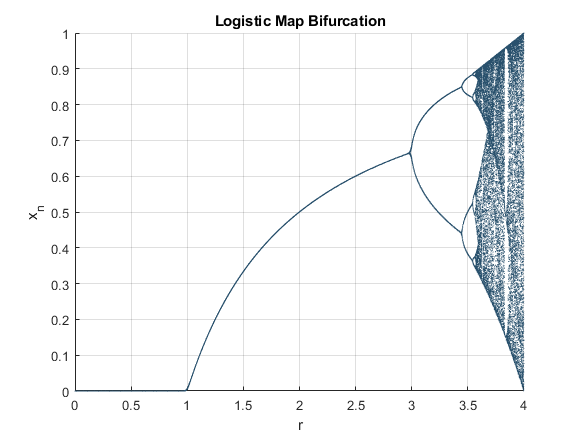
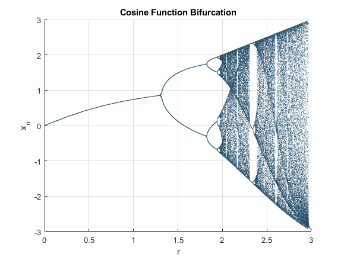

# Logistic Map — Bifurcation Diagram (MATLAB)
Small MATLAB script that iterates the logistic map and plots its bifurcation diagram.

## Requirements
- MATLAB (R2019a+ recommended)

## Quick start

Open MATLAB and run 'BifurcationDiagram.m'.

## Parameters (edit at the top of the script)

endpoint — upper bound for r (default 4)

n — number of iterations per r (default 200)

res — r step size / plot resolution (default 0.001)

By default the plot shows the last 25% of iterations to approximate steady state.

### Notes:

Switch to another single-hump map by uncommenting the alt line in the code.
